# Recommend_system
These are some algorithm about recommend movie

Now there are three algorithm:

### 1. Item-based collborative filtering
* ICF predict ratings
* ICF topN recommend

### 2. Latent factor model
* LFM predict ratings
* LFM topN recommend
  
### 3. Recommend movie base on movie's genre

## Dataset
We use data set of MovieLens which contain 100000 ratings from 3000+ users on 650 movies

We can see that most of the ratings are greater than 2. And popular movies have higher average rating.
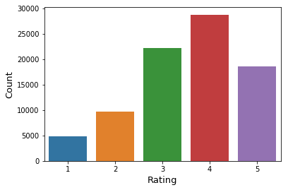
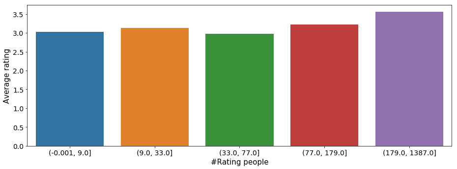

## Item-based collaborative filer
First method is ICF. We try different metrics to compute the nearst neighbours.We use Pearson,jaccard,IIF and also consider time. And finally we recommend 6 movies to users. Then computer how much movie apppear in test set and the ratings are greater than 2. These are the outcome.

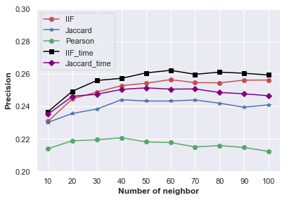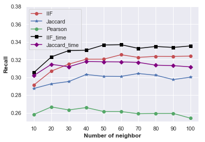

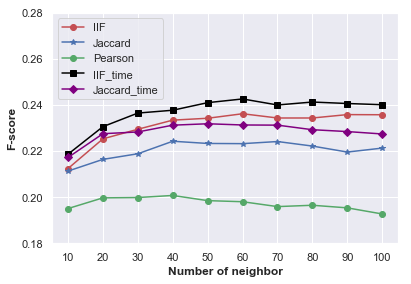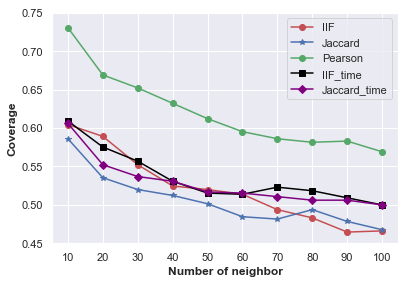

## LFM
Use LFM to computer recommend list. We do research on the relation between #classcount, ratio and precision,recall,Fscore,Coverage.

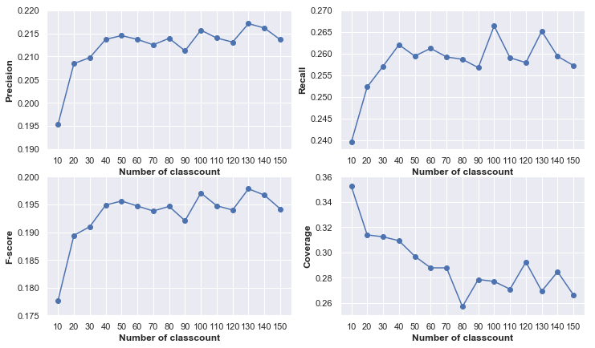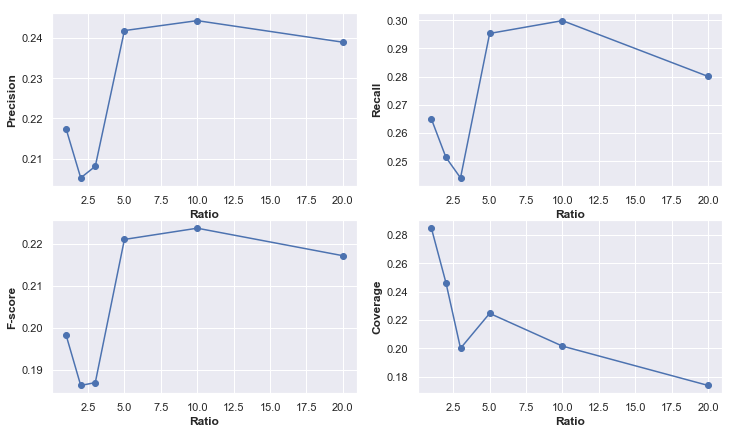

## Recommend based on genre
Firstly compute genre correlation

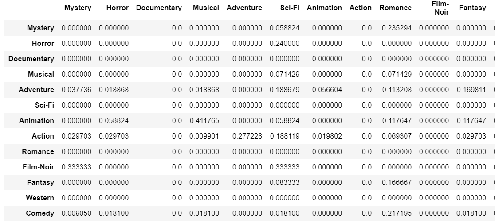

Then use these formular to compute the recommend point of movie:

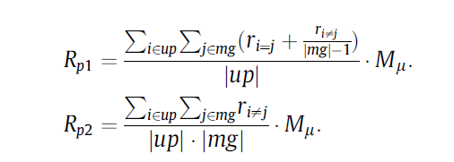

Finally,try to recommend movie to user. We compute that the precision is about 0.07, which is quite low. But we can see the concrete recommend list. We recommend movie to a kid, we can see the movie list is quite resonable.
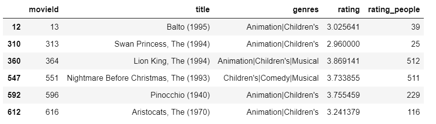

